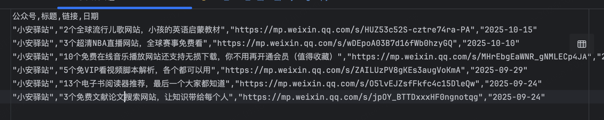
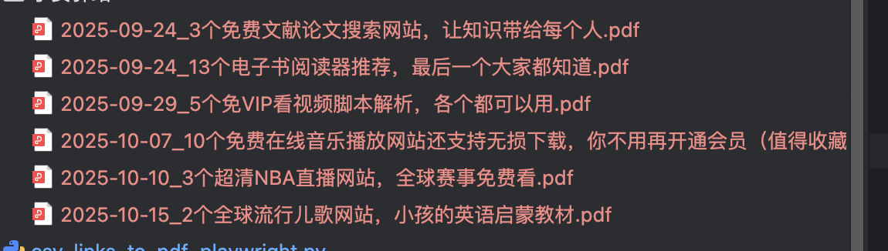
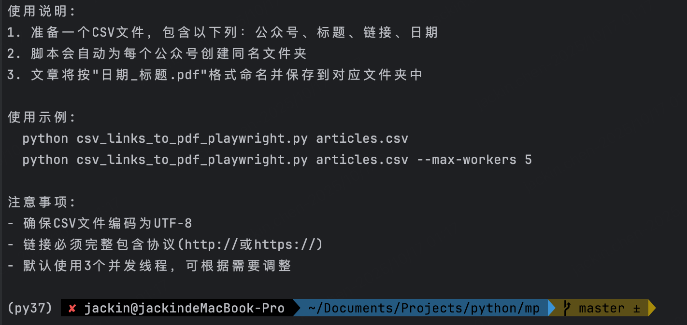
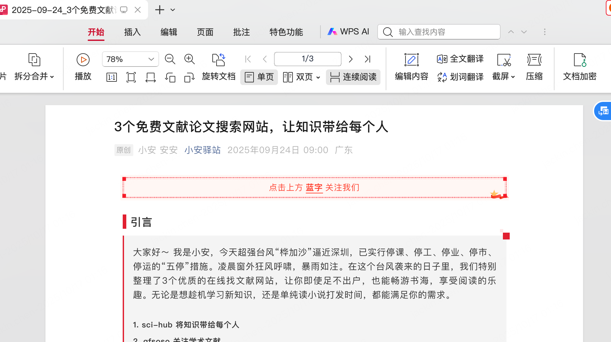

<div align="center">
  
  <h1>批量微信公众号文章转PDF工具</h1>
  <p>
    微信公众号文章链接批量转换为PDF文件
    <br />
    <i>⚡ 支持多线程处理、批量处理、自动保存、边距优化、图片加载、错误重试、日志记录</i>
  </p>
</div>


> 作者：小安  
> 公众号：小安驿站  
> 版本：1.0.0  

关注【小安驿站】公众号，获取更多实用工具和教程！

## 简介

本工具可以将微信公众号文章链接批量转换为PDF文件，并自动进行优化处理，包括：
- 自动裁剪PDF边距，提高阅读体验
- 按公众号分类存储PDF文件
- 智能等待图片加载完成
- 网络异常时自动重试

## 功能特点

- **批量处理**：通过CSV文件导入多个微信公众号文章链接
- **自动保存**：根据文章发布日期和标题自动生成文件名并保存为PDF
- **边距优化**：自动裁剪PDF边距，保留合适的左右边距
- **图片加载**：智能等待页面图片加载完成后再生成PDF
- **错误重试**：网络不稳定时自动重试，提高成功率
- **日志记录**：详细记录处理过程和结果


## 预览

<table>
  <tr>
    <td><b>文件内容</b></td>
    <td><b>下载pdf</b></td>
  </tr>
  <tr>
    <td></td>
    <td></td>
 </tr>
  <tr>
   <td></td>
    <td></td>
  </tr>
 <tr>
   <td></td>
    <td></td>
  </tr>
</table>


## 环境依赖

- Python 3.7+
- Playwright (用于网页渲染)
- pdfCropMargins (用于PDF边距裁剪)
- Ghostscript 或 Poppler (pdfCropMargins的依赖，其中Poppler提供pdftoppm工具)

## 安装步骤

### Windows 系统安装

1. 克隆或下载项目代码

2. 安装Python依赖包：
```cmd
pip install -r requirements.txt
```

3. 安装系统依赖：
   - 下载并安装 Ghostscript: https://www.ghostscript.com/download/gsdnld.html
   - 下载并安装 Poppler: https://github.com/oschwartz10612/poppler-windows/releases/
   - 将上述软件安装路径添加到系统环境变量PATH中

4. 安装Playwright浏览器：
```cmd
playwright install chromium
```

### macOS 系统安装

1. 克隆或下载项目代码

2. 安装Python依赖包：
```bash
pip install -r requirements.txt
```

3. 安装系统依赖：
```bash
brew install ghostscript poppler
```
#### 如果没有安装Homebrew，先安装Homebrew
```bash
卸载脚本
/bin/zsh -c "$(curl -fsSL https://gitee.com/cunkai/HomebrewCN/raw/master/HomebrewUninstall.sh)"

安装Homebrew
/bin/zsh -c "$(curl -fsSL https://gitee.com/cunkai/HomebrewCN/raw/master/Homebrew.sh)"
```

> 注意：在某些macOS版本上，GUI应用程序可能存在兼容性问题。如果遇到相关问题，建议使用命令行版本。

4. 安装Playwright浏览器：
```bash
playwright install chromium
```

### Linux 系统安装 (Ubuntu/Debian示例)

1. 克隆或下载项目代码

2. 安装Python依赖包：
```bash
pip install -r requirements.txt
```

3. 安装系统依赖：
```bash
sudo apt-get update
sudo apt-get install ghostscript poppler-utils
```

4. 安装Playwright浏览器：
```bash
playwright install chromium
```

## 使用方法

### 步骤一：准备文章链接CSV文件

创建一个CSV文件，包含以下字段：
- 公众号：文章来源公众号名称
- 标题：文章标题
- 链接：文章链接地址
- 日期：文章发布日期

示例格式：
```csv
公众号,标题,链接,日期
"小安驿站","2个全球流行儿歌网站，小孩的英语启蒙教材","https://mp.weixin.qq.com/s/HUZ53c52S-cztre74ra-PA","2025-10-15"
"小安驿站","3个超清NBA直播网站，全球赛事免费看","https://mp.weixin.qq.com/s/wDEpoA03B7d16fWb0hzyGQ","2025-10-10"
```

- 想自动收集文章链接，请借助 `公众号链接收集器`


### 步骤二：运行转换脚本

#### 命令行版本

使用以下命令运行脚本：

```bash
# 基本用法
python csv_links_to_pdf_playwright.py your_csv_file.csv

# 指定并发线程数（可选）
python csv_links_to_pdf_playwright.py your_csv_file.csv --max-workers 5
```

#### 图形界面版本

使用以下命令启动图形界面版本：

```bash
python gui_app_custom.py
```

在图形界面中，您可以：
1. 通过浏览按钮选择CSV文件
2. 设置并发线程数
3. 点击"开始转换"按钮开始处理
4. 在日志区域查看处理进度和结果
5. 随时点击"停止"按钮中止处理

转换后的PDF文件会按公众号名称分类保存在相应文件夹中。

> 注意：GUI版本在某些操作系统版本上可能存在兼容性问题。如果遇到问题，请使用命令行版本。

> 示例运行结果：
> ```
> 2025-10-20 18:00:35,180 - INFO - 开始处理 小安驿站_2025-10-16.csv
> 2025-10-20 18:00:35,181 - INFO - 开始处理 2个任务，使用 3 个并发线程
> 2025-10-20 18:01:19,981 - INFO - 已保存为PDF: 小安驿站/2025-10-15_2个全球流行儿歌网站，小孩的英语启蒙教材.pdf
> 2025-10-20 18:01:19,981 - INFO - 已保存为PDF: 小安驿站/2025-10-10_3个超清NBA直播网站，全球赛事免费看.pdf
> 2025-10-20 18:01:20,004 - INFO - 处理完成。成功: 2, 失败: 0
> ```

## 脚本参数说明

### csv_links_to_pdf_playwright.py

该脚本用于将CSV文件中的微信公众号文章链接转换为PDF文件。

**必需参数：**
- `csv_file`：CSV文件路径

**可选参数：**
- `--max-workers`：并发线程数，默认为3

## 配置说明

### CSV文件格式
- 公众号：用于创建文件夹分类保存PDF
- 标题：作为PDF文件名的一部分
- 链接：微信公众号文章链接
- 日期：作为PDF文件名的一部分，建议使用YYYY-MM-DD格式

## 注意事项

1. 工具会在同目录下生成日志文件`pdf_processing.log`，可以查看处理详情
2. 对于需要人机验证的链接，工具会跳过处理
3. 如果遇到PDF边距裁剪失败，请确认已正确安装Ghostscript或Poppler，并确保PATH环境变量包含了pdftoppm工具
4. 工具默认使用无头模式（headless）运行浏览器，不会弹出浏览器窗口
5. 如需处理大量文章，建议降低并发数以避免被网站限制
6. 微信公众号有反爬虫机制，频繁抓取可能会被限制访问
7. GUI版本在某些操作系统版本上可能存在兼容性问题，如遇到问题建议使用命令行版本

## 故障排除

1. 如果出现"signal only works in main thread"错误，请确认并发数设置为1
2. 如果PDF边距裁剪失败，请检查是否安装了Ghostscript或Poppler
3. 如果页面加载失败，可能是网络问题或目标网站反爬虫策略，可适当增加重试次数

## GUI界面安装注意事项和解决方案

### Tkinter模块缺失问题

在某些Python安装环境中，可能会遇到以下错误：
```
ModuleNotFoundError: No module named '_tkinter'
```

这表示Python环境中缺少Tkinter支持，解决方案如下：

#### macOS系统解决方案

1. 确保已安装tcl-tk库：
```bash
brew install tcl-tk
```

2. 使用pyenv重新安装Python并启用Tkinter支持：
```bash
unset PYENV_VERSION && export LDFLAGS="-L$(brew --prefix tcl-tk)/lib" && export CPPFLAGS="-I$(brew --prefix tcl-tk)/include" && export PKG_CONFIG_PATH="$(brew --prefix tcl-tk)/lib/pkgconfig" && export PYTHON_CONFIGURE_OPTS="--with-tcltk-includes='-I$(brew --prefix tcl-tk)/include' --with-tcltk-libs='-L$(brew --prefix tcl-tk)/lib -ltcl -ltk'" && pyenv install --force 3.11.9
```

3. 设置为默认Python版本：
```bash
pyenv global 3.11.9
```

#### 验证Tkinter是否可用

运行以下命令验证Tkinter是否正确安装：
```bash
python -c "import tkinter; print('Tkinter is available')"
```

### GUI界面使用说明

图形界面版本提供了更友好的用户交互体验：

1. **文件选择**：通过浏览按钮选择CSV文件和输出目录
2. **参数设置**：通过滑块调整并发线程数（1-10个线程）
3. **日志显示**：实时显示处理进度和结果
4. **操作按钮**：
   - 开始处理：启动转换任务
   - 退出：关闭应用程序

### GUI兼容性说明

GUI应用程序在以下情况下可能存在兼容性问题：

1. **操作系统版本**：GUI版本需要macOS 12.0.7或更高版本，较低版本可能存在兼容性问题
2. **Python环境**：某些Python安装可能缺少GUI支持库
3. **显示问题**：在高分辨率屏幕上可能需要调整窗口大小

如果遇到GUI兼容性问题，建议使用命令行版本执行任务。

## 版权声明

本工具仅供学习交流使用，请遵守相关法律法规，尊重知识产权。

关注【小安驿站】公众号，获取更多实用工具和教程！